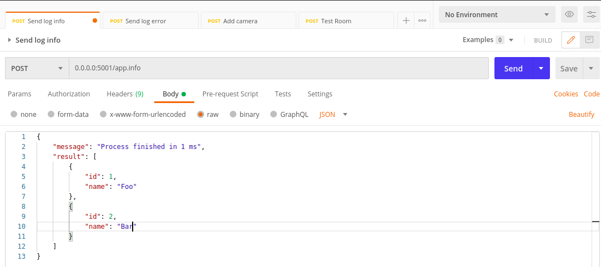
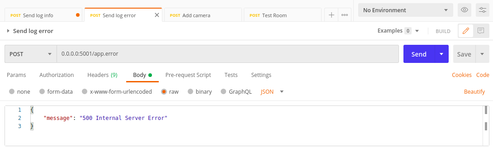
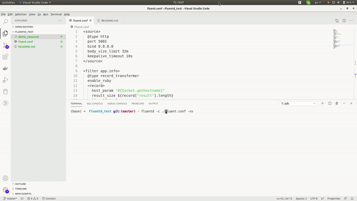

# Step to reproduce

## Install the fluentd

Follow the [instruction](https://docs.fluentd.org/installation) in here

## Run the fluentd
Start the service:
```
fluentd -c ./fluent.conf -vv
```

## Sample request
Sending info log:


Sending erre log:


## Explain the config
Define service to get the input through a port:
```
<source>
  @type http
  port 5001
  bind 0.0.0.0
  body_size_limit 32m
  keepalive_timeout 10s
</source>
```
The filter to input which from `app.info` tag:
```
<filter app.info>
  @type record_transformer
  enable_ruby
  <record>
    host_param "#{Socket.gethostname}"
    result_size ${record["result"].length}
    time ${time}
    tag ${tag}
  </record>
</filter>
```
Define the output, config the buffer to log to output every 1 min:
```
<match app.info>
  @type file
  path log/app.info.%Y-%m-%d.%H%M.log
  buffer_type file
  buffer_path buffer/info
  time_slice_format %Y-%m-%d.%H%M
  time_slice_wait 1m
  <format>
    @type json
  </format>
</match>
```

## Demo video

