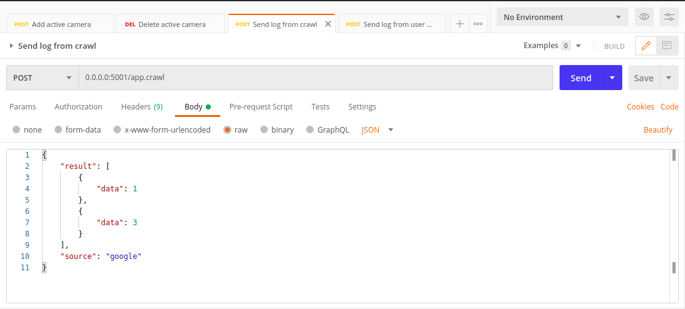
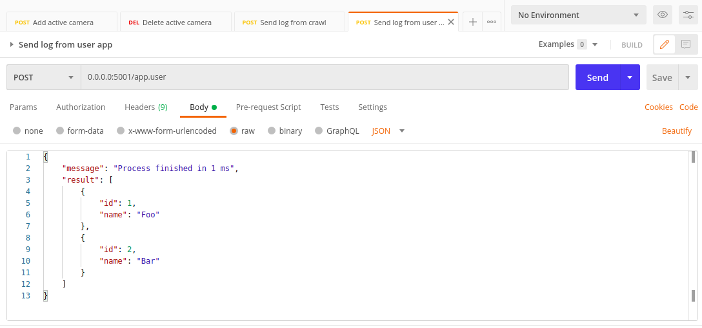

# Step to reproduce

## Install the fluentd

Follow the [instruction](https://docs.fluentd.org/installation) in here

## Run the fluentd
Start the service:
```
fluentd -c ./fluent.conf -vv
```

## Sample request
Sending crawl log:


Sending user log:


## Explain the config
Define service to listen to any request go to port 5001 and log them:
```
<source>
  @type http
  port 5001
  bind 0.0.0.0
  body_size_limit 32m
  keepalive_timeout 10s
</source>
```
Filter request send to `app.user`, we can add time and hostname to log as well:
```
<filter app.user>
  @type record_transformer
  enable_ruby
  <record>
    host_param "#{Socket.gethostname}"
    time ${time}
    tag ${tag}
  </record>
</filter>
```

Define the output, config the buffer to log to output every 1 min:
```
<match app.*>
  @type file
  path log/${tag}.%Y-%m-%d.%H%M
  flush_interval 1m
  append true
  <buffer tag,time>
    @type file
    path buffer/
    timekey 1m
    timekey_wait 1m
  </buffer>
  <format>
    @type json
  </format>
</match>
```

## Demo video


## 日本語
- Fluentdの使用の目的はロッグをフォーマットしたり、管理したり、ストレージとかデータベースとかに保存したりするということです。
- Fluentdは独立サービスとして実行できます。他のサビース、WebAppとかMobileAppとか、がロッグを送って、Fluentdがそのロッグを集めて、管理できます。
- データがローカルのバッファに保存し、設定された時間後で、ググルストレージに保存します。
